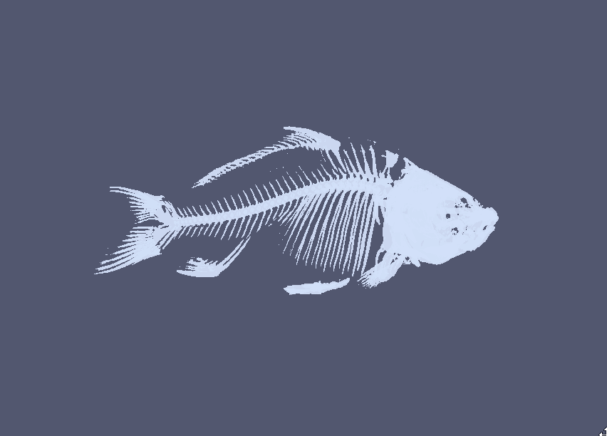

### Bone Stucrure of a Fish

{(aim|} The discovry of the scaned fish's bone structure was tha main aim of this presentation and was achieved perfecty. All the bones of the fish inclusing big and small are observable from this visualisation.
{|aim)}

{(vistype|} An isosurface volume representation
{|vistype)}

{(vismapping|} Each colour represented a value range in the data
{|vismapping)}

{(dataprep|} Apart from th rescalling done in the lastpart the cut off for isosurface was et at 1280. This means only the point with a higher value of 1280 is shown
{|dataprep)}

{(limitations|} There representation of the head of the fish can be improved to give the user more clear and higher quality visualisation. This visualisation can also work along with the last visualisation to understand the fish anatomy more seeminglessly.
{|limitations)}
